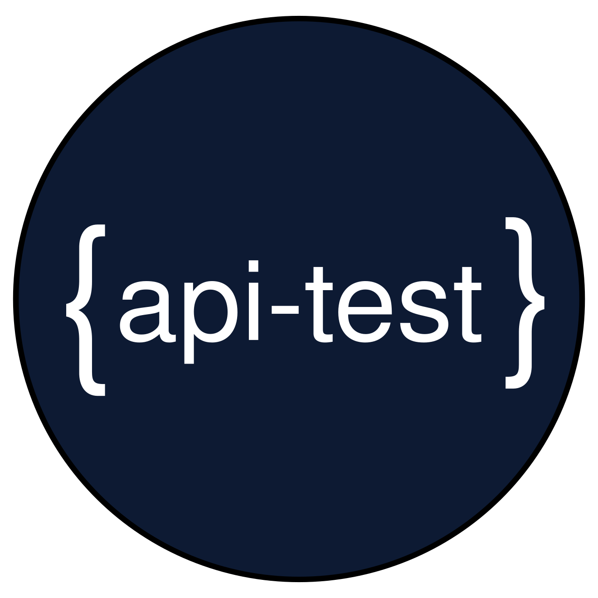

<!-- <HEADER> // IGNORE IT -->
<p align="center">


</p>

<div align="center">
  <h1>API testing framework for the terminal</h1>
</div>

<br />
<!-- </HEADER> // NOW BEGINS THE README -->

api-test is a simple bash script to test JSON API from terminal in a structured and organized way.


Docs: [https://subeshbhandari.com/api-test](https://subeshbhandari.com/api-test)

## Setting up

### Requirements

- [curl](https://curl.haxx.se/download.html)
- [jq](https://stedolan.github.io/jq/download)

In cloud 9 / CentOs / aws linux image

```sh
sudo yum install jq
```

## Installing

Pull the script

```sh
curl -LJO https://raw.githubusercontent.com/subeshb1/api-test/master/api-test.sh
```

Make the script executable

```sh
chmod +x api-test.sh
```

Move it to `/usr/local/bin` to make it executable from anywhere

```
sudo mv api-test.sh /usr/local/bin/api-test
```

Check if the installation is successful

```
api-test --help
```

### Alternate Approach

Since it is a small bash file, you can copy the content in https://raw.githubusercontent.com/subeshb1/api-test/master/api-test.sh and paste in a file, make it executable and run it.

## Usage

```sh
$ api-test.sh -h

A simple program to test JSON APIs.

USAGE: api-test [-hv] -f file_name [CMD] [ARGS]

OPTIONS:
  -h (--help)       print this message
  -v (--verbose)    verbose logging
  -f (--file)       file to test
  --version         print the version of the program

COMMANDS:
  run               Run test cases specified in the test file.
  test              Run automated test in the test file.
  describe          List test cases or describe the contents in a test case.

Run 'api-test COMMAND --help' for more information on a command.
```

### Test file

The test file will contain test cases in json format.

Example:
`test.json`

```js
{
  "name": "My API test",
  "testCases": {
    "test_case_1": {
      "path": "/path_1",
      "method": "POST",
      "description": "Best POST api",
      "body": {
        "value": 1
      },
      "header": {
        "X-per": "1"
      },
      "retry": {
        "count": 1,
        "delay": 2000
      }
    },
    "test_case_2": {
      "path": "/path_2",
      "method": "GET",
      "description": "Best GET api",
      "query": {
        "value": 1
      },
      "delay": 5000
    },
    "test_case_3": {
      "path": "/path_1",
      "method": "DELETE",
      "description": "Best DELETE api",
      "body": {
        "value": 1
      }
    }
  },
  "url": "localhost:3000",
  "header": {
    "Authorization": "Bearer <ACCESS_TOKEN>"
  }
}
```

The test cases are present in the `testCases` object. The main url for the api is store in `url` string. If the test cases share common headers add them in root `header` key.

If a test case needs a delay before it is executed add the optional `delay` key with the number of milliseconds to wait as value.

To compansate for random errors or if the API endpoint needs an unknown time to be ready to successfully process the request
a test case can provide the optional `retry` object containing the maximum number of retries as `count` and an optional
`delay` in milliseconds before attempting the next retry.

To pull the `template.json`

```sh
curl -LJO https://raw.githubusercontent.com/subeshb1/api-test/master/template.json
```

### Running test case

```sh
api-test -f test.json run test_case_1 # running single test case
api-test -f test.json run test_case_1 test_case_2 # running multiple test case
api-test -f test.json run all # running all test case. WARNING: Don't name a test case `all`
api-test -v -f test.json run test_case_1 # To run in verbose mode use `-v`
```

## Automated testing

To run an automated test run,

```sh
api-test -f test.json test test_case_1
api-test -f test.json test all # To run all tests
```


Both the headers and body can be compared to create automated api tests using different types of checking schemes described in further sections. All the checking schemes can be used for a test case.
To define test units add them in `expect` object in the testCase.

```js
{
  "test_case_1": {
    "path": "/path_1",
    "method": "POST",
    "expect": { // automated tests are kept inside this object
      "header": {
        ...
      },
      "body": {
        ...
      }
    }
  }
}
```

There are 5 ways you can compare the result from the api response.

### 1. eq

The `eq` check compares every element in an object irrespective of the order of object keys and array elements. Every element in compared object should match as the object defined in `eq` block.

#### Syntax

```js
{
  ...
  "expect": {
    "body": {
      "eq": {
        "key": "value"
      }
    }
  }
}

```

Example:
The api has following response.

```js
{
  "name": "ram",
  "age": 20
}
```

To test using `eq` check:

```js
{
  ...
  "expect": {
    "body": {
      "eq": {
        "name": "ram",
        "age": 20
      }
    }
  }
}
```

The check will pass for the above response. If any of the value or key is different it will throw error.

### 2. contains

The `contains` check compares the expected value with all the possible subset of the compared object irrespective of the order of object keys and array elements. It will pass if the value matches any subset.

#### Syntax

```js
{
  ...
  "expect": {
    "body": {
      "contains": {
        "key": "value"
      }
    }
  }
}

```

Example:
The api has following response.

```js
{
  "name": "ram",
  "age": 20
}
```

To test using `contains` check:

```js
{
  ...
  "expect": {
    "body": {
      "contains": {
        "age": 20
      }
    }
  }
}
```

The check will pass for the above response as `"age": 20` is the subset of response.

### 3. hasKeys

The `hasKeys` will check if the provided keys in array are present in the response or not.

#### Syntax

```js
{
  ...
  "expect": {
    "body": {
      "hasKeys": []
    }
  }
}

```

Example:
The api has following response.

```js
{
  "people": [
    {
      "name": "ram",
      "age": 20
    },
    {
      "name": "Shyam",
      "age": 21
    }
  ]
}
```

To test using `hasKey` check:

```js
{
  ...
  "expect": {
    "body": {
      "hasKeys": ["people", "people.0", "people.1", "people.0.name", "people.1.name"]
    }
  }
}
```

All the above keys are valid in the response. We can compare the key at any depth. While accessing arrays, be sure to use the index without brackets. The key accessing pattern contradicts with the next two checking schemes where bracket is used to access array properties.

### 4. path_eq

The `path_eq` does the same check as `eq` but allows the check to be made inside JSON object path at any depth. The path accessing pattern follows javascript object accessing patterns.

#### Syntax

```js
{
  ...
  "expect": {
    "path_eq": {
      "path": {"key": "value:"},
      "path.key1.key": 1
    }
  }
}

```

Example:
The api has following response.

```js
{
  "people": [
    {
      "name": "ram",
      "age": 20
    },
    {
      "name": "Shyam",
      "age": 21
    }
  ]
}
```

To test using `path_eq` check:

```js
{
  ...
  "expect": {
    "body": {
      "path_eq": {
        "people[0]": {
          "name": "ram",
          "age": 20
        },
        "people[1].name": "Shyam"
      }
    }
  }
}
```

The above example shows how to access an object path to compare and check the values at any depths.

### 5. path_contains

The `path_contains` does the same check as `contains` but allows the check to be made inside JSON object path at any depth. The path accessing pattern follows javascript object accessing patterns.

#### Syntax

```js
{
  ...
  "expect": {
     "body": {
      "path_contains": {
        "path": "value",
        "path.key1.key": "value"
      }
     }
  }
}

```

Example:
The api has following response.

```js
{
  "people": [
    {
      "name": "ram",
      "age": 20
    },
    {
      "name": "Shyam",
      "age": 21
    }
  ]
}
```

To test using `path_contains` check:

```js
{
  ...
  "expect": {
    "body": {
      "path_contains": {
        "people[0]": {
          "name": "ram",
        },
        "people[1].name": "Shyam",
        "people": []
      }
    }
  }
}
```

### 6. External scripts or program

If none of the above checks work for you, there is a way to inject **any language** to compare and test an api response. To do so, provide the command name or script in the `external` key in the `expect` block. If a test case passes return an `exit code 0` and if a test fails `exit code > 0` to communicate with the `api-test` program.

#### Syntax

```js
{
  ...
  "expect": {
    "body": {...},
    "header": {...},
    "external": "<your program>"
  }
}
```

Example:

test.json

```js
{
  ...
  "expect": {
    "body": {...},
    "header": {...},
    "external": "node test.js"
  }
}

```

test.js

```js
let testCase = process.argv[2]; // First arg will be test case key
let body = process.argv[3]; // Second arg will be body
let header = process.argv[4]; // Third arg will be header

let success = true;
switch (testCase) {
  case "get_api":
    if (success) {
      process.exit(0); // For success case
    } else {
      process.exit(1); // For failure case
    }
    break;
  case "invalid_post_api":
    ...
    break;

  default:
    break;
}
```

The `test case key`, `body` and `header` are passed respectively to the supplied program. You can use any language as long as you are sending out the correct exit code for failure and success.

The above example shows how to access an object path to compare and check the values at any depths. All the above comparison are a subset of response and will pass the check.

## Uninstalling

```
rm /usr/local/bin/api-test
```
